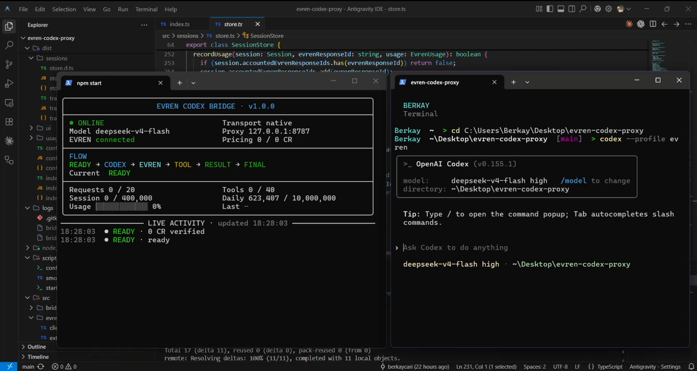

# EVREN Codex Bridge

OpenAI Codex CLI'yi EVREN'in OpenAI uyumlu Responses API'siyle kullanmak için bağımsız bir uyumluluk köprüsüdür. Yerel olarak çalışır, araç yürütme denetimini Codex'te tutar ve model çıkarımı için `deepseek-v4-flash` kullanır.

## Neden var?

Codex CLI ile OpenAI uyumlu bir Responses endpoint'i; araçları, devam durumunu ve reasoning geçmişini temsil etme biçimleri bakımından farklılık gösterebilir. Bu proje, Codex'i değiştirmeden veya EVREN'in kendisinin bozuk olduğunu ileri sürmeden, EVREN entegrasyon testleri sırasında gözlemlenen davranışları uyarlar.

Köprü özellikle yerel ve dar kapsamlı tutulmuştur: Codex Responses isteklerini `127.0.0.1` üzerinde kabul eder, yalnızca desteklenen alanları dönüştürür, çıkarım isteklerini EVREN'e gönderir ve Codex uyumlu yanıtlar döndürür.

## Mimari

```text
Codex CLI
    ↓
EVREN Codex Bridge (127.0.0.1)
    ↓
Native Responses compatibility
    ↓
EVREN / deepseek-v4-flash
```

Varsayılan yöntem native transport'tur. Standart function araçları standart function olarak aktarılır; Codex custom tool'ları ise `input` string'i içeren strict function'lar olarak sarmalanır. Devam durumu, yerel ve temizlenmiş bir oturum geçmişinden yeniden oluşturulur; reasoning geçmişi filtrelenir ve textual tool protokolü açıkça seçilebilen bir fallback olarak kullanılabilir.

## Özellikler

- Native Responses transport
- Codex function/custom tool uyumluluğu
- Yerel stateless continuation adaptörü
- Sıralı tool call güvenliği
- Geçmiş tool output'larının yeniden oynatılmasına karşı koruma
- Hata durumunda güvenli biçimde kapalı kalan fiyatlandırma koruması
- Kesin kullanım verisine dayalı muhasebe
- İstek, oturum, gün ve tool call bazında limitler
- Yalnızca localhost üzerinde çalışan sunucu
- Gizli bilgileri koruyan yapılandırılmış loglama
- Olay güdümlü canlı TTY dashboard'u
- Textual fallback transport

## Gereksinimler

- Node.js 20 veya daha yeni bir sürüm
- OpenAI Codex CLI
- EVREN API anahtarı
- Birlikte sunulan kurulum yardımcıları için PowerShell

## Kurulum

```powershell
git clone https://github.com/berkaycari/evren-codex-proxy.git
cd evren-codex-proxy
npm.cmd install
npm.cmd run typecheck
npm.cmd test
npm.cmd run build
```

Repo bir npm paketi olarak yayımlanmamıştır; `private: true` bilinçli bir tercihtir.

## Yapılandırma

`.env.example`, desteklenen ortam değişkenlerini belgeler; ancak köprü bir gizli bilgi dosyası gerektirmez. API anahtarını yalnızca geçerli işlem içinde ayarlamayı tercih edin:

```powershell
$env:EVREN_API_KEY = (Get-Clipboard -Raw).Trim()
```

Gerçek bir `.env` dosyasını veya API anahtarını asla commit etmeyin. `.gitignore`; yalnızca yer tutucu değerler içeren `.env.example` dışında `.env*` dosyalarını, ayrıca çalışma zamanı loglarını ve kullanım verilerini hariç tutar.

Gizli olmayan sayısal limitler, `config/defaults.json` içindeki adlara karşılık gelen büyük harfli adlarla geçersiz kılınabilir. Sunucu adresi, EVREN base URL'si ve model bilinçli olarak ortam değişkenleriyle değiştirilemez. Tool transport yalnızca `native` veya `textual` değerlerini kabul eder.

## Kullanım

İlk terminalde proxy'yi derleyip başlatın:

```powershell
cd evren-codex-proxy
.\scripts\start-proxy.ps1
```

Yalıtılmış Codex provider profilini bir kez yapılandırın:

```powershell
.\scripts\configure-codex-evren-proxy.ps1
```

Yardımcı betik değişikliklerin ön izlemesini gösterir, onay ister ve zaman damgalı bir yedek oluşturur. Yalnızca EVREN provider tablosunu ve ayrı EVREN profilini yönetir; ilgisiz Codex ayarlarını değiştirmez.

Ardından, üzerinde çalışmak istediğiniz repodan Codex'i başlatın:

```powershell
cd <project-directory>
codex --profile evren
```

Proxy şu endpoint'leri sunar:

- `GET /health` — güvenli fiyatlandırma, bağlantı ve kullanım özeti
- `GET /v1/models` — Codex uyumlu model kataloğu
- `POST /v1/responses` — JSON ve SSE Responses adaptörü

## Dashboard



EVREN Codex Bridge'in gerçek zamanlı terminal dashboard'u.

Köprü, bir TTY içinde yalnızca gerçek köprü durumunu gösteren alternatif ekranlı bir dashboard açar: bağlantı, seçili transport, model, fiyatlandırma, istek/araç/token sayaçları, geçerli FLOW aşaması, son sonuç ve gizli bilgileri koruyan etkinlik akışı. FLOW, gerçek olaylara göre `READY → CODEX → EVREN → TOOL → RESULT → FINAL` sırasıyla ilerler; hatalar `ERROR` olarak gösterilir.

Animasyon zamanlayıcısı, simüle edilmiş trafik veya yapay token etkinliği yoktur. Görüntü yalnızca köprü durumu değiştiğinde ya da terminal yeniden boyutlandırıldığında yenilenir. Normal TTY dışı/düz loglama davranışını kullanmak için `NO_DASHBOARD=1` ayarlayın.

## Demo

25–30 saniyelik bir okuma/yazma demosu için köprüyü başlatın ve bu repo içinde EVREN profiliyle Codex'i çalıştırın. Aşağıdaki promptu aynen yapıştırın. İki gerçek terminal tool call'u gerçekleştirir ve `.gitkeep` dışındaki `data/*` dosyaları göz ardı edildiğinden izlenen bir değişiklik bırakmaz.

```text
Run a quick read/write smoke test only inside the current repository.

Use exactly 2 terminal tool calls.

Tool call 1:
- Read package.json from disk and obtain the actual package name.
- Create data/.evren-demo-smoke.txt containing exactly:
  EVREN_NATIVE_OK
- Report in the tool output whether the write operation succeeded.

Tool call 2:
- Read data/.evren-demo-smoke.txt back from disk.
- Verify whether the contents exactly equal:
  EVREN_NATIVE_OK
- Delete only data/.evren-demo-smoke.txt.
- Confirm whether the file no longer exists.
- Report in the tool output:
  - the actual package name
  - whether the write succeeded
  - whether the read-back exact-match verification succeeded
  - whether cleanup succeeded

Do not touch any other file.
Do not install anything.
Do not commit or push.
Do not make network requests.

After the second tool result, reply using only facts actually verified from the tool outputs.

Use this exact format:

package=<actual package name read from package.json>
write=<pass or fail based on the tool result>
read=<pass or fail based on the exact read-back verification>
cleanup=<pass or fail based on the file deletion verification>
tools=2

Do not assume or hard-code any success value.
Do not report pass unless the tool output proves it.
```

## Güvenlik

- Sunucu yalnızca `127.0.0.1` adresine bağlanır.
- Başlangıçta ve düzenli aralıklarla yapılan fiyat kontrollerinde, her iki token fiyatı da tam olarak `0 CR` olmadığı sürece köprü güvenli biçimde kapalı kalır.
- API anahtarları ve bilinen yetkilendirme alanları yapılandırılmış loglarda maskelenir.
- Prompt'lar, tool argument'ları, komutlar, ham tool output'ları, reasoning ve bilinmeyen olay meta verileri dashboard etkinliğinin dışında tutulur.
- Eksik veya tutarsız kesin kullanım bilgisi hiçbir zaman sıfır sayılmaz; yeniden başlatılana kadar başka çıkarım yapılması engellenir.
- Oturum, gün, istek, tahmini input, output, tool call ve tool output limitleri uygulanmaya devam eder.
- Çalışma zamanı kullanım dosyaları, göz ardı edilen `data/` altında atomik olarak yazılır; loglar ise göz ardı edilen `logs/` altına yazılır.

Köprü kendi başına shell komutları yürütmez, proje dosyalarını okumaz veya araçları çalıştırmaz. Araç yürütme Codex'in denetimindedir.

## Uyumluluk notları

Geliştirme dönemindeki canlı entegrasyon testlerinde şunlar gözlemlenmiştir:

- EVREN native standard function call'ları başarıyla tamamlandı.
- Test edilen akışta `previous_response_id` üzerinden server-state continuation kullanılamadı; full-history continuation çalıştı.
- Geçmişte `reasoning_text` yeniden oynatıldığında bir uyumluluk sorunu oluştu.
- Native custom tool tanımlarının round trip işlemleri tutarlı biçimde güvenilir değildi.
- Bu nedenle köprü, Codex custom tool'larını standart bir function wrapper'a dönüştürür ve reasoning geçmişini filtreler.

Bunlar, bu proje için kullanılan EVREN/Codex sürümleri ve test dönemiyle ilgili gözlemlerdir; EVREN platformunun kalıcı davranışına ilişkin garanti değildir. Taraflardan biri değiştiğinde bunları yeniden doğrulayın.

## Textual fallback

Varsayılan yöntem native transport'tur. Bir oturumda önceki textual tool protokolünü kullanmak için:

```powershell
$env:EVREN_TOOL_TRANSPORT = 'textual'
.\scripts\start-proxy.ps1
```

Textual mod, mevcut katalog/prompt protokolünü ve tek düzeltme denemesini korur. Fiyatlandırma, kullanım, oturum veya güvenlik limitlerini değiştirmez.

## Test

Otomatik kontroller:

```powershell
npm.cmd run typecheck
npm.cmd test
npm.cmd run build
git diff --check
```

Manuel sürüm kabulü ayrıca native ve textual transport'ları, canlı EVREN bağlantısını, normal ve dar genişliklerde dashboard FLOW/renklerini, iki araçlı demoyu, `Ctrl+C` sonrasında terminalin eski hâline dönmesini, TTY dışı çıktıyı ve `NO_DASHBOARD=1` davranışını doğrulamalıdır.

Anahtar önceden ayarlanmışsa araç içermeyen isteğe bağlı, minimum bir canlı çıkarım testi kullanılabilir:

```powershell
npm.cmd run smoke:evren
```

## Sorun giderme

- `EVREN_API_KEY is required`: anahtarı geçerli PowerShell işlemi içinde ayarlayın.
- `/health` çıktısı `blocked` bildiriyor: güvenli fiyatlandırma nedenini ve köprü olay günlüğünü inceleyin.
- `usage_accounting_uncertain`: EVREN geçerli bir kesin kullanım bilgisi döndürmedi; güvenli biçimde yeniden başlatın ve durum tekrarlanırsa araştırın.
- `unknown_previous_response_id`: yerel oturumun süresi doldu veya köprü yeniden başlatıldı; yeni bir Codex oturumu başlatın.
- `usage_limit_exceeded`: yeni bir oturum başlatın, sonraki muhasebe gününü bekleyin veya bilinçli bir sayısal limit geçersiz kılma değeri kullanın.
- Model kataloğu hatası: provider base URL'sinin tam olarak `http://127.0.0.1:8787/v1` olduğunu doğrulayın.

## Lisans

[MIT Lisansı](LICENSE) kapsamında lisanslanmıştır.
