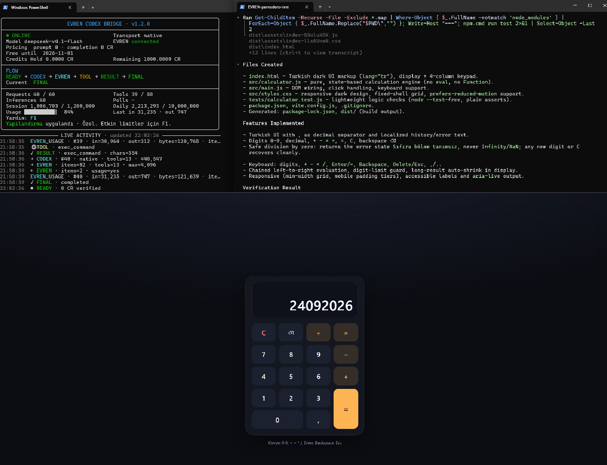
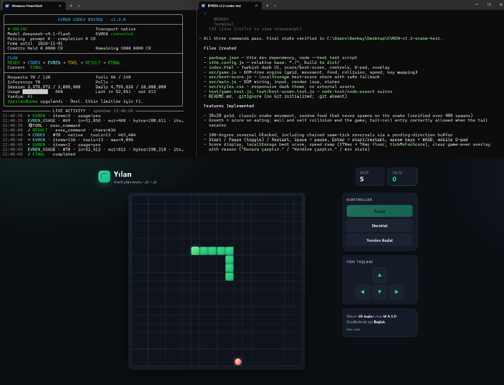

# EVREN Codex Bridge

EVREN Codex Bridge, OpenAI Codex CLI'yi EVREN'in OpenAI uyumlu Responses API'siyle kullanmak için geliştirilmiş bağımsız bir uyumluluk köprüsüdür. Yerel olarak çalışır, araçların yürütülmesini Codex'in denetiminde tutar ve model çıkarımı için varsayılan olarak `deepseek-v4.1-flash` modelini kullanır.

Bu belge EVREN Codex Bridge `v1.2.0` sürümünü açıklar. Bu sürüm OpenAI Codex CLI `0.156.1` ile test edilmiştir; bu ifade diğer sürümlerin çalışmadığı anlamına gelmez.

## Amaç

Codex CLI ile OpenAI uyumlu bir Responses uç noktası; araçları, konuşma devamlılığını ve akıl yürütme geçmişini farklı biçimlerde temsil edebilir. Bu proje, Codex'i değiştirmeden, EVREN entegrasyon testlerinde gözlemlenen bu uyumluluk farklarını giderir.

Köprü bilinçli olarak yerel ve dar kapsamlı tutulmuştur: Codex Responses isteklerini `127.0.0.1` üzerinde kabul eder, yalnızca desteklenen alanları dönüştürür, çıkarım isteklerini EVREN'e iletir ve Codex uyumlu yanıtlar döndürür.

## Mimari

```text
Codex CLI
    ↓
EVREN Codex Bridge (127.0.0.1)
    ↓
Native Responses compatibility
    ↓
EVREN / deepseek-v4.1-flash
```

Varsayılan aktarım yöntemi `native` seçeneğidir. Standart işlev araçları doğrudan standart işlev olarak aktarılır; Codex özel araçları ise `input` dizgesi içeren katı şemalı işlevler olarak sarmalanır. Konuşmanın devamı, temizlenmiş yerel oturum geçmişinden yeniden oluşturulur; akıl yürütme geçmişi filtrelenir. Metin tabanlı araç protokolü gerektiğinde açıkça seçilebilen bir geri dönüş seçeneğidir.

## Özellikler

- Yerel Responses aktarımı
- Codex işlev ve özel araç uyumluluğu
- Sunucu durumuna dayanmayan yerel devamlılık uyarlaması
- Sıralı araç çağrısı güvenliği
- Geçmiş araç çıktılarının yeniden oynatılmasına karşı koruma
- Kanonik geçmişin yapısal olarak tekilleştirilmesi ve yerel çok turlu devamlılık
- Beklenmeyen çoklu yerel işlev çağrısı yanıtlarında güvenli ilk çağrı serileştirmesi
- Yinelenen belirlenimci hatalara ve gereksiz token tüketimine karşı devre kesici
- Hata durumunda güvenli biçimde kapalı kalan fiyatlandırma koruması
- EVREN yanıtındaki kesin kullanım verisini esas alan muhasebe
- Uzun süren `write_stdin` polling dizileri için güvenli sayaç, kesin token görünürlüğü, uyarı ve isteğe bağlı yerel hard cap
- Sistem talimatı, kanonik geçmiş, kabul edilmiş araç çıktısı geçmişi, araç kataloğu ve geçerli girdi için ayrı sayısal payload ölçümleri
- Çıktı bütçesi doygunluğu ve güvenilir Codex metadata sınıfları için güvenli tanı olayları
- Başlangıçta bir kez çalışan, başarısızlığı köprüyü etkilemeyen anonim GitHub sürüm denetimi
- İstek, oturum, gün ve araç çağrısı sınırları
- Yalnızca yerel makinede dinleyen sunucu
- Gizli bilgileri koruyan yapılandırılmış günlükleme
- Olay güdümlü canlı TTY gösterge paneli
- Gösterge panelinden `F1` ile açılan Türkçe Yardım / Hızlı Başlangıç ve yapılandırma akışı
- Metin tabanlı geri dönüş aktarımı

## Gereksinimler

- Node.js 20 veya daha yeni bir sürüm
- OpenAI Codex CLI (bu sürüm `0.156.1` ile test edilmiştir)
- EVREN API anahtarı
- Birlikte sunulan kurulum yardımcıları için PowerShell

## Kurulum

```powershell
git clone https://github.com/berkaycari/evren-codex-proxy.git
cd evren-codex-proxy
npm.cmd install
npm.cmd run typecheck
npm.cmd test
npm.cmd run build
```

Depo bir npm paketi olarak yayımlanmamıştır; `private: true` bilinçli bir tercihtir.

## Yapılandırma

`.env.example`, desteklenen ortam değişkenlerini belgeler; ancak köprü gizli bilgi içeren bir dosya gerektirmez. API anahtarını yalnızca geçerli işlem ortamında ayarlayın:

```powershell
$env:EVREN_API_KEY = (Get-Clipboard -Raw).Trim()
```

Gerçek bir `.env` dosyasını veya API anahtarını hiçbir zaman Git'e işlemeyin. `.gitignore`, yalnızca yer tutucu değerler içeren `.env.example` dışındaki `.env*` dosyalarını, çalışma zamanı günlüklerini ve kullanım verilerini dışarıda bırakır.

Gizli olmayan sayısal sınırlar, `config/defaults.json` içindeki alanlara karşılık gelen büyük harfli ortam değişkenleriyle geçersiz kılınabilir. Sunucu adresi, EVREN temel URL'si ve model bilinçli olarak ortam değişkenleriyle değiştirilemez. Araç aktarım yöntemi yalnızca `native` veya `textual` değerini kabul eder.

İsteğe bağlı ve gizli bilgi içermeyen yerel ayarlar `config/local.json` dosyasına yazılabilir. Bu dosya git tarafından yok sayılır ve bulunması zorunlu değildir. Öncelik sırası şöyledir:

```text
ortam değişkeni > config/local.json > config/defaults.json
```

`config/local.json`; `maxSessionTokens`, `maxDailyTokens`, `maxRequestsPerSession`, `maxToolCallsPerSession`, `maxEstimatedInputTokensPerCall`, `maxOutputTokensPerCall`, `sessionTtlMinutes`, `toolOutputMaxChars`, `toolPollWarningThreshold`, `maxConsecutiveToolPollInferences`, `pricingRefreshMinutes`, `requestTimeoutMs` ve `updateCheckEnabled` alanlarını destekler. Sayısal alanlar pozitif tam sayı olmalıdır; yalnızca `maxConsecutiveToolPollInferences` için `0` hard cap'i kapatmak anlamına gelir. `updateCheckEnabled` yalnızca boolean kabul eder. Bilinmeyen, geçersiz veya gizli bilgi izlenimi veren bir alan bulunduğunda köprü açık bir hatayla başlatılmaz. Bu dosyaya gizli bilgi yazmayın; `EVREN_API_KEY` ayrı tutulur ve yalnızca işlem ortamından okunur.

Windows üzerinde ayarları etkileşimli olarak düzenlemek için isteğe bağlı yardımcıyı çalıştırın:

```powershell
.\scripts\configure-bridge.ps1
```

Betik üç preset sunar. Seçimi `↑` / `↓` ile yapın, `Enter` ile onaylayın veya `Esc` ile iptal edin:

- `Standard`: ana güvenlik limitlerini `maxSessionTokens=1200000`, `maxDailyTokens=10000000`, `maxRequestsPerSession=60`, `maxToolCallsPerSession=80` ve `maxOutputTokensPerCall=4096` değerlerine getirir; diğer desteklenen yerel ayarları korur.
- `Coding`: uzun coding-agent işleri için ana güvenlik limitlerini `maxSessionTokens=3000000`, `maxDailyTokens=10000000`, `maxRequestsPerSession=120`, `maxToolCallsPerSession=140` ve `maxOutputTokensPerCall=4096` değerlerine getirir; diğer desteklenen yerel ayarları korur.
- `Custom`: izin verilen alanların mevcut etkileşimli düzenleme akışını açar.

Depo varsayılanları normal/orta büyüklükte işler için `maxSessionTokens=1200000`, `maxRequestsPerSession=60`, `maxToolCallsPerSession=80`, `maxDailyTokens=10000000` ve `maxOutputTokensPerCall=4096` değerlerini kullanır. Preset'ler model yeteneğini veya model context window'unu değiştirmez; yalnızca yerel güvenlik sınırlarını değiştirir. `Enter` tuşu geçerli değeri korur. Betik yalnızca `config/local.json` dosyasını atomik olarak yazar; köprünün normal başlangıcı bu betiği çalıştırmaz.

Polling ayarlarının varsayılanları `toolPollWarningThreshold=3` ve `maxConsecutiveToolPollInferences=0` değerleridir. Köprü yalnızca tam adı `write_stdin` olan ve Codex şemasındaki `session_id` alanını taşıyan çağrıları poll olarak tanır. Süreç kimliği yalnızca SHA-256 özetiyle oturum belleğinde tutulur; komut, araç argümanları, süreç kimliği ve araç çıktısı olaylara yazılmaz. Varsayılan davranış uyarı ve ölçümdür. İsteğe bağlı pozitif hard cap etkinleşirse bir sonraki poll devamı EVREN çağrısından önce kararlı bir yerel `400 tool_poll_limit_reached` hatasıyla durur; yeni çıkarım, kullanım veya araç çağrısı oluşturmaz. Bu seçenek uzun süren meşru işlemi de durdurabileceği için varsayılan olarak kapalıdır.

`updateCheckEnabled=true` varsayılanıyla köprü, süreç başına en fazla bir kez GitHub'ın herkese açık `latest release` metadata uç noktasına kısa zaman aşımıyla anonim `GET` isteği yapar. Bu istek kimlik doğrulama, `EVREN_API_KEY`, istem, oturum, kullanıcı veya araç verisi içermez. Güncelleme otomatik uygulanmaz; `git pull`, kurulum veya build çalıştırılmaz. Çevrimdışı durum, zaman aşımı, rate limit ya da bozuk yanıt başlangıcı ve çıkarımı engellemez. Tam opt-out için `UPDATE_CHECK_ENABLED=false` kullanın veya `config/local.json` içinde `"updateCheckEnabled": false` ayarlayın.

## Kullanım

İlk terminalde köprüyü derleyip başlatın:

```powershell
cd evren-codex-proxy
.\scripts\start-proxy.ps1
```

Yalıtılmış Codex sağlayıcı profilini bir kez yapılandırın:

```powershell
.\scripts\configure-codex-evren-proxy.ps1
```

Yardımcı betik değişikliklerin ön izlemesini gösterir, onay ister ve zaman damgalı bir yedek oluşturur. Yalnızca EVREN sağlayıcı tablosunu ve ayrı EVREN profilini yönetir; ilgisiz Codex ayarlarını değiştirmez.

Yapılandırılan sağlayıcı URL'si `http://127.0.0.1:8787/v1` olmalıdır.

Ardından Codex'i üzerinde çalışmak istediğiniz depodan başlatın:

```powershell
cd <project-directory>
codex --profile evren
```

### Etkileşimli terminal yardımı

Köprü terminalini açık bırakın. Canlı TTY gösterge panelinde yalnızca `F1`, Türkçe Yardım / Hızlı Başlangıç ekranını açar. İkinci bir terminal açın, `cd <project-directory>` ile Codex'in çalışacağı projeye geçin, `codex --profile evren` komutunu çalıştırın ve istemlerinizi Codex terminaline yazın; köprü terminali durum, kullanım, güvenlik, yapılandırma ve tanılama içindir.

Yardım içindeki `C`, yapılandırmayı açar. Preseti `↑` / `↓` ile seçip `Enter` ile onaylayın; `Standard` ve `Coding` özeti yine `↑` / `↓` ile seçilen `Uygula` / `Vazgeç` adımıyla kesinleşir. İşlem uygulandığında, iptal edildiğinde veya güvenli biçimde başarısız olduğunda terminal otomatik olarak dashboard'a döner. Normal/hafif işler için `Standard`, daha büyük coding-agent işleri için `Coding`, tüm desteklenen gizli olmayan alanları bilinçli biçimde düzenlemek için `Custom` kullanın. `Coding`, model yeteneğini veya varsayılan `maxOutputTokensPerCall=4096` değerini artırmaz.

Köprü şu uç noktaları sunar:

- `GET /health` — güvenli fiyatlandırma, bağlantı ve kullanım özeti
- `GET /v1/models` — Codex uyumlu model kataloğu
- `POST /v1/responses` — JSON ve SSE Responses uyarlayıcısı

## Gösterge paneli



EVREN Codex Bridge `v1.2.0` ile gerçekleştirilen gerçek bir coding-agent kabul testinden birleşik görüntü. Görsel; canlı köprü dashboard'unu, Codex agent çıktısını ve tarayıcıda çalışan Türkçe hesap makinesi arayüzünü aynı karede gösterir. Codex, `deepseek-v4.1-flash` üzerinden Vite + vanilla JavaScript projesini oluşturdu; temel hesaplama senaryolarını doğruladı ve üretim build'ini başarıyla tamamladı. Bu v1.2 çalışması ana Codex oturumunda `40` istek, `39` araç çağrısı ve `1.006.703` kesin oturum token'ı ile tamamlandı.

### v1.1 → v1.2 hesap makinesi gözlemi

v1.1 ve v1.2 kabul çalışmaları aynı uygulama sınıfını kullansa da istemleri ve çalışma koşulları birebir aynı değildir. Bu nedenle aşağıdaki değerler kontrollü bir performans benchmarkı veya nedensel bir verimlilik iddiası olarak değil, iki gerçek coding-agent çalışmasının gözlemsel karşılaştırması olarak okunmalıdır.

| Kabul çalışması | Oturum token'ı | İstek | Araç çağrısı |
| --- | ---: | ---: | ---: |
| v1.1 hesap makinesi | 1.118.374 | 51 | 48 |
| v1.2 hesap makinesi | 1.006.703 | 40 | 39 |
| Gözlenen fark | -111.671 (-%10,0) | -11 (-%21,6) | -9 (-%18,8) |

v1.2 çalışmasında daha düşük sayaçlar gözlenmiştir; ancak istem farkları, model davranışındaki değişkenlik ve araç yürütme ayrıntıları nedeniyle bu fark tek başına köprü sürümünün performans artışı olarak yorumlanmamalıdır.

### Snake coding-agent kabul testi



v1.2 sürüm kabulünün ikinci canlı coding-agent senaryosunda Codex, `deepseek-v4.1-flash` üzerinden Vite + vanilla JavaScript ile responsive ve Türkçe bir Snake oyunu oluşturdu. Oyun; `20×20` grid, klasik hareket ve büyüme, rastgele yem, duvar/kendi gövdesi çarpışması, ters yöne anlık dönüş koruması, skor ve `localStorage` tabanlı en iyi skor, hız artışı, klavye kontrolleri ve mobil yön düğmeleri içerir. Oyun mantığı tarayıcı DOM'undan ayrıştırılarak hafif Node testleriyle doğrulandı; kurulum, test ve üretim build adımlarının tamamı başarıyla geçti.

Bu daha ağır coding-agent çalışması aynı Codex oturumunda `70` istek, `66` araç çağrısı ve `2.578.972` kesin oturum token'ı ile tamamlandı; final yanıtta son kesin kullanım `52.412` girdi ve `812` çıktı token'ı olarak raporlandı. Test sırasında daha düşük bir geçici oturum tavanına güvenli biçimde ulaşıldı; yerel Custom güvenlik sınırı yükseltildikten sonra aynı proje durumu korunarak çalışma tamamlandı. Bu gözlem, oturum tavanının model context window'u değil, köprünün kümülatif yerel güvenlik sınırı olduğunu da pratikte doğrular.

Köprü, TTY ortamında yalnızca gerçek köprü durumunu gösteren alternatif ekranlı bir gösterge paneli açar. Panel; bağlantıyı, seçili aktarım yöntemini, modeli, fiyatlandırmayı, kredi başlıklarını, istek/çıkarım/araç/token sayaçlarını, etkin poll dizisini, geçerli `FLOW` aşamasını, son kesin girdi/çıktı kullanımını ve gizli bilgileri koruyan etkinlik akışını gösterir. `FLOW`, gerçek olaylara göre `READY → CODEX → EVREN → TOOL → RESULT → FINAL` sırasıyla ilerler; hatalar `ERROR` olarak gösterilir. Periyodik fiyat yenilemesi etkin bir `TOOL`, `CODEX` veya `EVREN` aşamasını `READY` ile ezmez. `Last` değeri EVREN yanıtındaki kesin `input_tokens` ve `output_tokens` alanlarından gelir. İstek öncesindeki `≈` değerler yalnızca güvenlik denetiminde kullanılan tahminlerdir.

`EVREN_USAGE` olayları toplam payload boyutuna ek olarak talimat, kanonik geçmiş, kabul edilmiş araç çıktısı geçmişi, geçerli girdi ve araç kataloğu byte değerlerini ayrı verir. Native aktarım stateless üst hizmete her çıkarımda tam geçerli araç kataloğunu göndermek zorundadır; v1.2 bu katalogdan tahmine dayalı araç çıkarmaz ve kayıplı geçmiş sıkıştırması yapmaz. `foreground` ve `internal` sınıfları yalnızca Codex'in tanınan `request_kind` metadata değeriyle atanır; kanıt yoksa kullanım `unclassified` kalır. Günlük kesin toplam tüm ayrı oturumları içerir ve sınıflandırma toplamı bunun üzerine ikinci kez eklenmez.

EVREN'in kesin `output_tokens` değeri yapılandırılmış `maxOutputTokensPerCall` değerine eşit veya ondan büyükse `OUTPUT_BUDGET_SATURATED` uyarısı oluşur. Bu yalnızca doygunluk kanıtıdır; yanıt otomatik olarak geçersiz ya da kesin kesilmiş sayılmaz. Aynı yanıtta protokol dönüşümü başarısız olursa güvenli hata mesajı bu olası ilişkiyi belirtir. Varsayılan çıktı bütçesi `4096` olarak kalır.

Fiyat satırı, model kataloğundaki `prompt_token_price`, `completion_token_price`, `currency` ve varsa `free_until` değerlerini gösterir. EVREN ayrıca bir fiyat birimi tanımlamadığı için panel token başına ek bir birim varsaymaz. Başarılı çıkarım yanıtlarında alınan geçerli `X-Evren-Credits-Held` ve `X-Evren-Credits-Remaining` değerleri son güvenilir kredi durumu olarak gösterilir; eksik veya geçersiz değerlerin yerinde `—` görünür. Bu başlıklardan istek maliyeti veya zorunlu harcama hesabı türetilmez.

Animasyon zamanlayıcısı, benzetilmiş trafik veya yapay token etkinliği yoktur. Görüntü yalnızca köprü durumu değiştiğinde ya da terminal yeniden boyutlandırıldığında yenilenir. TTY dışındaki normal düz günlük çıktısını kullanmak için `NO_DASHBOARD=1` ayarlayın.

## Gösterim

25–30 saniyelik bir okuma/yazma gösterimi için köprüyü başlatın ve bu depo içinde EVREN profiliyle Codex'i çalıştırın. Aşağıdaki istemi aynen yapıştırın. İstem iki gerçek terminal aracı çağrısı yaptırır; `.gitkeep` dışındaki `data/*` dosyaları göz ardı edildiği için izlenen bir değişiklik bırakmaz.

```text
Run a quick read/write smoke test only inside the current repository.

Use exactly 2 terminal tool calls.

Tool call 1:
- Read package.json from disk and obtain the actual package name.
- Create data/.evren-demo-smoke.txt containing exactly:
  EVREN_NATIVE_OK
- Report in the tool output whether the write operation succeeded.

Tool call 2:
- Read data/.evren-demo-smoke.txt back from disk.
- Verify whether the contents exactly equal:
  EVREN_NATIVE_OK
- Delete only data/.evren-demo-smoke.txt.
- Confirm whether the file no longer exists.
- Report in the tool output:
  - the actual package name
  - whether the write succeeded
  - whether the read-back exact-match verification succeeded
  - whether cleanup succeeded

Do not touch any other file.
Do not install anything.
Do not commit or push.
Do not make network requests.

After the second tool result, reply using only facts actually verified from the tool outputs.

Use this exact format:

package=<actual package name read from package.json>
write=<pass or fail based on the tool result>
read=<pass or fail based on the exact read-back verification>
cleanup=<pass or fail based on the file deletion verification>
tools=2

Do not assume or hard-code any success value.
Do not report pass unless the tool output proves it.
```

## Güvenlik ve sınırlamalar

- Sunucu yalnızca `127.0.0.1` adresine bağlanır.
- Başlangıçta ve düzenli aralıklarla yapılan fiyat kontrollerinde, her iki token fiyatı da tam olarak `0 CR` olmadığı sürece köprü güvenli biçimde kapalı kalır.
- Sıfırdan farklı CR harcama sınırları henüz uygulanmaz. Kredi başlıkları yalnızca görünürlük sağlar ve harcama sınırı olarak kullanılmaz; mevcut sıfır-fiyat koruması bilinçli olarak sürdürülür.
- API anahtarları ve bilinen yetkilendirme alanları yapılandırılmış günlüklerde maskelenir.
- İstemler, araç bağımsız değişkenleri, komutlar, ham araç çıktıları, akıl yürütme içeriği ve bilinmeyen olay üst verileri gösterge paneli etkinlik akışına alınmaz.
- Eksik veya tutarsız kesin kullanım bilgisi hiçbir zaman sıfır sayılmaz; yeniden başlatılana kadar başka çıkarım yapılması engellenir.
- Oturum, gün, istek, tahmini girdi, çıktı, araç çağrısı ve araç çıktısı sınırları uygulanmaya devam eder.
- Çalışma zamanı kullanım dosyaları, göz ardı edilen `data/` dizinine atomik olarak yazılır; günlükler ise göz ardı edilen `logs/` dizininde tutulur.

Köprü kendi başına kabuk komutu yürütmez, proje dosyalarını okumaz veya araç çalıştırmaz. Araçların yürütülmesi Codex'in denetimindedir.

## Uyumluluk notları

Geliştirme dönemindeki canlı bütünleştirme testlerinde şunlar gözlemlenmiştir:

- EVREN'in yerel standart işlev çağrıları başarıyla tamamlandı.
- Üst EVREN hizmetinde `previous_response_id` ile devamlılık desteklenmediği için köprü bu alana dayanmaz; konuşmayı yerel kanonik geçmişle sürdürür.
- EVREN, `parallel_tool_calls=false` gönderildiğinde bile birden fazla yerel işlev çağrısı döndürebilir. Köprü yalnızca ilk çağrıyı güvenli biçimde işler, diğer çağrıları aynı yanıtta yürütmez ve ilk araç sonucundan sonra kararı yeniden EVREN'e bırakır.
- Aynı belirlenimci başarısız isteğin yinelenmesi, gereksiz üst hizmet denemelerini ve token tüketimini sınırlayan yerel bir devre kesiciyle durdurulur.
- Geçmişte `reasoning_text` yeniden oynatıldığında bir uyumluluk sorunu oluşmuştur.
- Yerel özel araç tanımlarının gidiş-dönüş aktarımı tutarlı biçimde güvenilir değildir.
- Bu nedenle köprü, Codex özel araçlarını standart bir işlev sarmalayıcısına dönüştürür ve akıl yürütme geçmişini filtreler.

Bunlar, bu proje için kullanılan EVREN/Codex sürümleri ve test dönemiyle ilgili gözlemlerdir; EVREN platformunun kalıcı davranışına ilişkin garanti değildir. Taraflardan biri değiştiğinde bunları yeniden doğrulayın.

## Metin tabanlı geri dönüş

Varsayılan aktarım yöntemi `native` seçeneğidir. Bir oturumda önceki metin tabanlı araç protokolünü kullanmak için:

```powershell
$env:EVREN_TOOL_TRANSPORT = 'textual'
.\scripts\start-proxy.ps1
```

`textual` modu, mevcut katalog ve istem protokolüyle tek düzeltme denemesini korur. Fiyatlandırma, kullanım, oturum veya güvenlik sınırlarını değiştirmez.

## Test ve doğrulama

Otomatik kontroller:

```powershell
npm.cmd run typecheck
npm.cmd test
npm.cmd run build
git diff --check
```

Elle sürüm kabulü ayrıca `native` ve `textual` aktarım yöntemlerini, canlı EVREN bağlantısını, normal ve dar terminal genişliklerinde gösterge panelinin `FLOW` akışını ve renklerini, iki araçlı gösterimi, `Ctrl+C` sonrasında terminalin önceki durumuna dönmesini, TTY dışı çıktıyı ve `NO_DASHBOARD=1` davranışını doğrulamalıdır.

Anahtar önceden ayarlanmışsa araç içermeyen isteğe bağlı küçük bir canlı çıkarım testi çalıştırılabilir:

```powershell
npm.cmd run smoke:evren
```

## Sorun giderme

- `EVREN_API_KEY is required`: anahtarı geçerli PowerShell işlemi içinde ayarlayın.
- `/health` çıktısı `blocked` bildiriyor: güvenli fiyatlandırma nedenini ve köprü olay günlüğünü inceleyin.
- `usage_accounting_uncertain`: EVREN geçerli bir kesin kullanım bilgisi döndürmedi; güvenli biçimde yeniden başlatın ve durum tekrarlanırsa araştırın.
- `unknown_previous_response_id`: yerel oturumun süresi doldu veya köprü yeniden başlatıldı; yeni bir Codex oturumu başlatın.
- `usage_limit_exceeded`: yeni bir oturum başlatın, sonraki muhasebe gününü bekleyin veya bilinçli bir sayısal limit geçersiz kılma değeri kullanın.
- Model kataloğu hatası: sağlayıcı temel URL'sinin tam olarak `http://127.0.0.1:8787/v1` olduğunu doğrulayın.
- Windows üzerinde `npm.cmd install` sertifika/CA hatası veriyor veya TLS aşamasında takılı görünüyorsa proje terminalinde aşağıdakini deneyebilirsiniz; bu ayar tüm npm sorunlarını çözeceğine dair bir garanti değildir ve köprü çalışma zamanına otomatik eklenmez:

```powershell
$env:NODE_OPTIONS="--use-system-ca"
npm.cmd install
```

- Uzun süren paket yöneticisi komutları Codex'in çalışan işlemi `write_stdin` ile tekrar tekrar yoklamasına ve her karar için ek model token'ı tüketmesine neden olabilir. Dashboard'daki etkin `Polls` sayacını ve poll token toplamını izleyin; gerekirse işlemi veya Codex oturumunu bilinçli biçimde yönetin.

## Lisans

[MIT Lisansı](LICENSE) kapsamında lisanslanmıştır.
