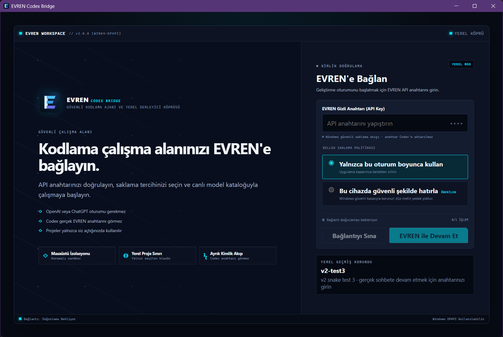
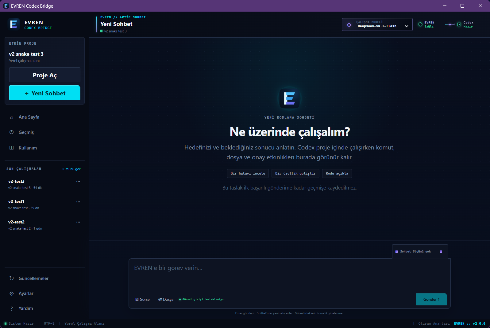
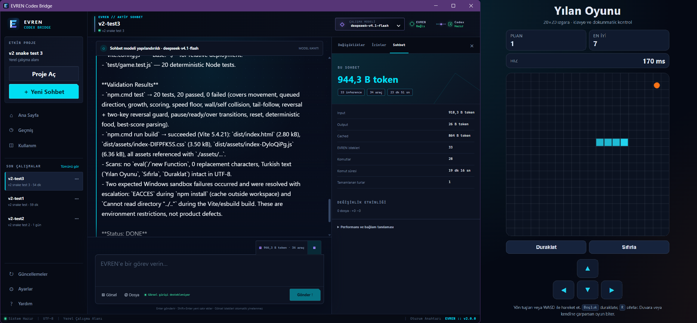

# EVREN Codex Bridge

**EVREN Codex Bridge**, EVREN yapay zekâ modellerini Codex coding-agent altyapısıyla birleştiren Windows masaüstü uygulamasıdır.

Kendi EVREN API anahtarınızı kullanarak projeleriniz üzerinde yapay zekâ destekli kodlama görevleri gerçekleştirebilir; dosyaları inceleyebilir, kod oluşturabilir, değişiklikleri yönetebilir ve komutları tek bir çalışma alanından çalıştırabilirsiniz.

EVREN, Codex'in araç kullanma yeteneklerini kendi masaüstü arayüzü ve EVREN model altyapısıyla bir araya getirir.

**Sürüm:** 2.0.0  
**Platform:** Windows x64  
**Codex Runtime:** 0.157.1

---

## EVREN ile tanışın

EVREN Codex Bridge, ilk kurulumdan itibaren sade ve bütünleşik bir çalışma deneyimi sunar.

### Kolay ve güvenli başlangıç



Başlamak için EVREN API anahtarınızı girmeniz yeterlidir.

- OpenAI API anahtarı veya ChatGPT oturumu gerekmez.
- Sistem genelinde ayrıca Codex kurulumu yapmanız gerekmez.
- EVREN API anahtarı Codex'e doğrudan verilmez.
- API anahtarınızı yalnızca mevcut oturumda kullanabilir veya cihazınızda güvenli biçimde saklayabilirsiniz.
- Kullanılabilir modeller canlı EVREN kataloğundan alınır.

API anahtarını kalıcı olarak saklama seçeneği, işletim sisteminin güvenli depolama desteği üzerinden çalışır. Güvenli depolama kullanılamıyorsa düz metin olarak kalıcı kayıt yapılmaz.

### Kendi çalışma alanınız



EVREN Desktop, kodlama görevlerinizi tek bir arayüzde yönetmenizi sağlar.

Çalışma alanında:

- Yerel proje klasörünüzü açabilirsiniz.
- EVREN kataloğundan kullanmak istediğiniz modeli seçebilirsiniz.
- Yeni sohbetler oluşturabilir ve önceki çalışmalarınıza dönebilirsiniz.
- Codex'in yürüttüğü araçları ve komutları takip edebilirsiniz.
- Gerektiğinde araç kullanımına izin verebilir veya isteği reddedebilirsiniz.
- Aktif görevleri durdurabilirsiniz.
- Sohbetin token kullanımını ve çalışma bilgilerini inceleyebilirsiniz.

EVREN ve Codex bağlantı durumları ayrı ayrı gösterilir. Böylece modelden yanıt bekleme, komut çalıştırma ve onay bekleme gibi aşamaları takip edebilirsiniz.

### Gerçek coding-agent deneyimi



EVREN yalnızca sorulara cevap veren bir sohbet uygulaması değildir.

Codex, EVREN modellerinden aldığı yanıtlarla seçtiğiniz proje üzerinde gerçek geliştirme işlemleri gerçekleştirebilir.

Bir görev sırasında:

1. Proje dosyalarını inceleyebilir.
2. Yeni dosyalar oluşturabilir veya mevcut kodu düzenleyebilir.
3. Terminal komutları çalıştırabilir.
4. Gerekli bağımlılıkları yükleyebilir.
5. Testleri ve production build işlemlerini çalıştırabilir.
6. Sonuçları ve yaptığı değişiklikleri raporlayabilir.

Yukarıdaki görüntü, EVREN Codex Bridge V2 ile gerçekleştirilen gerçek bir coding-agent oturumunu ve üretilen responsive Türkçe Snake oyununu göstermektedir.

---

## Öne çıkan özellikler

### Dinamik model seçimi

EVREN modelleri canlı katalog üzerinden yüklenir.

Sohbet kullanımına uygun modeller seçilebilir. Seçilen model, Codex ve Bridge üzerinden EVREN'e yönlendirilirken model kimliği doğrulanır.

Mevcut bir sohbetin modeli, kullanıcıdan habersiz başka bir modele dönüştürülmez.

### Araçlar ve izin yönetimi

Codex bir komut veya dosya işlemi için onay istediğinde EVREN bunu çalışma alanında gösterir.

Desteklenen işlemlere göre:

- **Bir Kez Onayla**
- **Oturum için Onayla**
- **Reddet**

seçenekleri sunulur.

Sağ taraftaki **İzinler** panelinden bekleyen onaylar ve izin etkinlikleri görüntülenebilir.

İzin seçenekleri Codex'in gerçekten desteklediği kararlarla sınırlıdır. Oturumluk izinleri sonradan iptal etmeye yönelik bir kontrol, mevcut Codex protokolünde güvenli şekilde desteklenmediği için sunulmaz.

### Değişiklikleri inceleme

EVREN'in **Değişiklikler** paneli, coding-agent tarafından yapılan dosya işlemlerini incelemenize yardımcı olur.

Git projelerinde:

- Oluşturulan, değiştirilen ve silinen dosyalar görüntülenebilir.
- Eklenen ve silinen satırlar incelenebilir.
- Dosya farkları görüntülenebilir.
- Değişiklikler korunabilir veya güvenli koşullarda geri alınabilir.

**Değişikliği Koru**, otomatik olarak Git commit oluşturmaz.

**Geri Al** işlemi, mevcut kullanıcı değişikliklerini korumak amacıyla çalışma ağacı, dosya içeriği ve Git durumunu kontrol eder.

Git olmayan projelerde yalnızca gözlemlenebilen dosya etkinlikleri sunulur. Eksiksiz dosya farkı garanti edilmez ve güvenli bir başlangıç durumu bulunmadığında otomatik geri alma devre dışıdır.

### Sohbet geçmişi ve çalışmaya devam etme

EVREN, Codex'in gerçek sohbet/thread yapısını kullanır.

Uygulamayı kapatıp yeniden açtığınızda önceki bir coding-agent oturumuna dönebilirsiniz.

**Geçmiş** ekranında sohbetlerinizi arayabilir, proje bazında filtreleyebilir, yeniden adlandırabilir, sabitleyebilir ve kaldırabilirsiniz.

**Son Çalışmalar** listesi, sohbetlerin anlamlı etkinlik zamanlarını esas alır. Eski bir sohbeti yalnızca okumak için açmak, onu listenin başına taşımaz.

### Sohbet bazlı kullanım bilgileri

Her sohbetin kullanım bilgileri ayrı tutulur ve uygulama yeniden açıldığında görüntülenebilir.

**Sohbet** panelinde, mevcut verilerin kapsamına göre:

- Toplam, girdi ve çıktı tokenları
- Sağlayıcının bildirdiği önbellek tokenları
- İstek ve inference sayıları
- Araç ve komut çağrıları
- Görev ve komut süreleri
- Bağlam ve performans tanılaması

görüntülenebilir.

Token değerleri ile byte cinsinden ölçülen yerel bağlam/payload bilgileri birbirinden ayrı gösterilir.

Bu veriler doğrudan EVREN kredi bakiyesi veya faturalandırma tutarı anlamına gelmez.

### Görsel girdi

Görsel girişini desteklediği canlı katalogda belirtilen modellerle PNG, JPEG ve WebP dosyaları kullanılabilir.

Görsel ekleri gönderilmeden önce biçim, boyut ve dosya bütünlüğü açısından doğrulanır.

Kullanılamayan görsel yetenekleri ve sağlayıcı kaynaklı hatalar kullanıcıya ayrı şekilde bildirilir.

Görsel işleme başarısı seçilen modele ve EVREN servisinin kullanılabilirliğine bağlıdır. Görsel taşıma akışı otomatik olarak test edilmiştir; gerçek sağlayıcı üzerinde başarılı görsel inference kabulü ayrıca doğrulanmalıdır.

### Temalar ve erişilebilirlik

EVREN Desktop üç farklı tema sunar:

- **Navy / EVREN**
- **Dark**
- **Light**

Uygulama; farklı pencere genişlikleri, klavye kullanımı, görünür odak durumları ve azaltılmış hareket tercihi dikkate alınarak tasarlanmıştır.

---

## Windows kurulumu

EVREN Codex Bridge V2, Windows x64 için **Setup** ve **Portable** seçenekleriyle paketlenir.

### Setup

Standart Windows kurulumu için:

```text
EVREN-Codex-Bridge-Setup-2.0.0.exe
```

### Portable

Kurulum yapmadan çalıştırmak isteyen kullanıcılar için:

```text
EVREN-Codex-Bridge-Portable-2.0.0.exe
```

Sürüm dosyaları yayımlandıklarında [GitHub Releases](https://github.com/berkaycari/evren-codex-proxy/releases) sayfasından edinilebilir.

Her iki dağıtım biçimi de gerekli EVREN Desktop bileşenlerini ve bundled Codex runtime'ı içerir.

**Masaüstü uygulamasını kullanmak için ayrıca Node.js, npm, sistem Codex kurulumu veya OpenAI oturumu gerekmez.**

Ancak üzerinde çalışılan projenin ihtiyaç duyduğu geliştirme araçları (Node.js, Python, .NET, Rust vb.) proje görevine göre gerekli olabilir.

> **Windows güvenlik bildirimi:** V2 yerel dağıtım paketleri dijital olarak imzasızdır. Windows SmartScreen ilk çalıştırmada uyarı gösterebilir. Dosyaları yalnızca güvenilir yayın kaynağından edinin.

### İlk çalıştırma

1. EVREN Codex Bridge uygulamasını açın.
2. EVREN API anahtarınızı girin.
3. Anahtarınızı saklama tercihinizi belirleyin.
4. Bağlantıyı doğrulayın.
5. Kullanmak istediğiniz modeli seçin.
6. **Proje Aç** ile çalışma klasörünüzü belirleyin.
7. **Yeni Sohbet** üzerinden görevinizi gönderin.

Yeni bir sohbet, ilk geçerli görev gönderilene kadar taslak olarak kalır. Yalnızca **Yeni Sohbet** düğmesine basılması gereksiz bir Codex thread'i oluşturmaz.

---

## Güncelleme Merkezi

EVREN Codex Bridge, masaüstü uygulaması ve Codex runtime güncellemelerini ayrı yönetir.

**Desktop güncellemeleri**, yayımlanan uygulama sürümlerini kontrol eder.

**Codex Runtime güncellemeleri**, sürüm ve dosya bütünlüğü bilgileri doğrulanan runtime paketlerini kullanır.

Aktif bir coding-agent görevi sırasında runtime değiştirilmez.

Yerel güncelleme ve paketleme kontrolleri, yayımlanmış bir sürüm üzerinden gerçekleşen uçtan uca güncelleme doğrulamasından ayrıdır.

---

## Güvenlik ve gizlilik

EVREN Desktop, API anahtarının ve yerel çalışma ortamının korunması için sınırlı güvenlik yüzeyleri kullanır.

- EVREN API anahtarı Codex child process'e doğrudan aktarılmaz.
- Güvenli kalıcı saklama için Electron `safeStorage` kullanılır.
- API anahtarı düz metin kalıcı depolamaya düşürülmez.
- Yerel Bridge, `127.0.0.1` üzerinde geçici bir port kullanır.
- Codex ile Bridge arasında yerel kimlik doğrulaması uygulanır.
- Renderer, Electron Main'e sınırlı preload IPC arayüzü üzerinden erişir.
- Bilinmeyen onay istekleri otomatik olarak kabul edilmez.
- Hassas kimlik bilgileri tanılama çıktılarından ayrıştırılır.
- Ham reasoning / chain-of-thought normal sohbet arayüzüne veya geçmişe aktarılmaz.

EVREN Desktop, kullanıcının sistem genelindeki `~/.codex/config.toml` dosyasını değiştirmez.

---

## Kaynak koddan çalıştırma

EVREN Codex Bridge açık kaynaklıdır.

Kaynak koddan çalıştırmak için Node.js ve npm gerekir.

```powershell
git clone https://github.com/berkaycari/evren-codex-proxy.git
cd evren-codex-proxy

npm install
npm start
```

Geliştirme modu:

```powershell
npm run desktop:dev
```

Temel doğrulama komutları:

```powershell
npm run typecheck
npm test
npm run build
```

Desktop / Codex smoke testleri:

```powershell
npm run smoke:codex-app-server
npm run smoke:bundled-codex
npm run smoke:desktop
```

Windows paketlerini oluşturmak için:

```powershell
npm run desktop:dist
```

---

## Klasik terminal Bridge

V2, önceki terminal tabanlı kullanım biçimini de korur.

Bu akışta **sistem Codex CLI kurulumu gereklidir**.

### Terminal 1 — Bridge

Repo klasöründe:

```powershell
$env:EVREN_API_KEY = "your-key-here"
npm run bridge
```

### Terminal 2 — Codex

Çalışılacak proje klasöründe:

```powershell
cd <project-directory>
codex --profile evren
```

Klasik Bridge, Codex isteklerini yerel Bridge üzerinden EVREN Responses API'ye uyarlar.

> Sistem Codex gereksinimi yalnızca klasik terminal kullanımı içindir. Setup ve Portable Desktop sürümleri bundled Codex runtime kullanır.

---

## Bundled Codex Runtime

EVREN Codex Bridge 2.0.0 ile birlikte **Codex 0.157.1** paketlenir.

Windows x64 runtime yapısı:

```text
resources/codex/win32-x64/
├─ bin/
│  ├─ codex.exe
│  └─ codex-code-mode-host.exe
├─ codex-path/
│  └─ rg.exe
├─ codex-resources/
│  ├─ codex-command-runner.exe
│  └─ codex-windows-sandbox-setup.exe
└─ codex-package.json
```

Paketlenen runtime dosyalarının sürüm ve SHA-256 bilgileri:

```text
resources/codex/bundle-manifest.json
```

üzerinden takip edilir.

OpenAI Codex bileşenlerinin lisans bildirimi:

[`resources/codex/LICENSE-OPENAI-CODEX.txt`](resources/codex/LICENSE-OPENAI-CODEX.txt)

---

## Bilinen sınırlamalar

- V2'nin bundled runtime ve dağıtım hedefi **Windows x64**'tür.
- Dağıtım paketleri dijital olarak imzasızsa Windows SmartScreen uyarısı görülebilir.
- Audio, video, OCR ve ASR; V2 Desktop ana sohbet akışının parçası değildir.
- Görsel giriş kullanılabilirliği seçilen EVREN modelinin canlı yeteneklerine ve upstream servis durumuna bağlıdır.
- Git olmayan projelerde Change Review eksiksiz bir filesystem journal değildir; yalnızca güvenilir biçimde gözlemlenebilen etkinliği gösterir.
- EVREN kredi bakiyesi ve harcama limiti yönetimi bu sürümün parçası değildir.

---

## Lisans

EVREN Codex Bridge, [MIT Lisansı](LICENSE) kapsamında yayımlanır.

Bundled OpenAI Codex bileşenlerinin lisans bildirimi:

[`resources/codex/LICENSE-OPENAI-CODEX.txt`](resources/codex/LICENSE-OPENAI-CODEX.txt)

Electron paketinde `LICENSE.electron.txt` ve `LICENSES.chromium.html` dosyaları bulunur.
